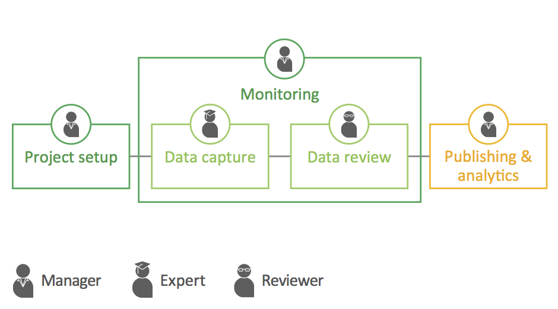
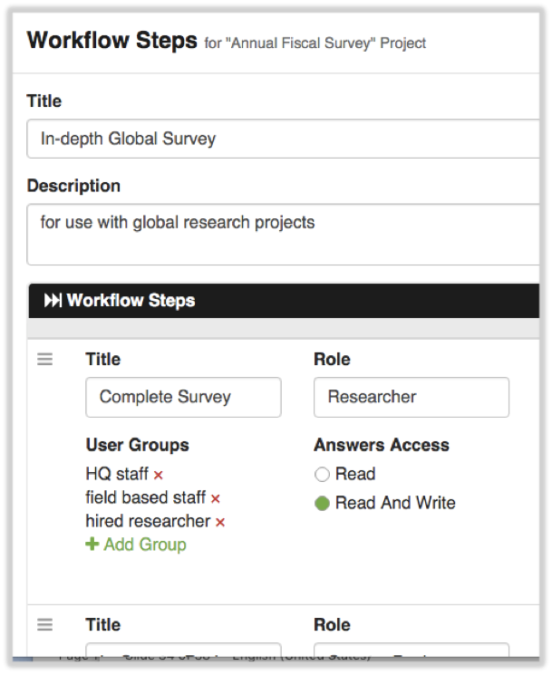

[Indaba by Amida](indaba.amida-tech.com)

## High Level Overview

Indaba puts your stakeholder and expert network at your fingertips. It converts their knowledge into data that you can analyze, publish, and use to make decisions.

### Indaba's Process



---

### Data collection and management


---

### Data review and dissemination



---

## Prerequisites
### Backend
- Node.js (v5 - we recommend using [node version manager](https://github.com/creationix/nvm))
- PostgreSQL
- pgAdmin (optional)
- memcached
- nginx (for server deployment)

### Frontend
- Ruby
- Compass
- Node.js and npm

## Deployment with Docker
NOTE: when using a Docker image with dependencies and minified files, it is a good idea
to rebuild with the `--no-cache` option.
---

1. Set up a Docker Postgres container:

`docker run --name indaba-postgres -e POSTGRES_PASSWORD=indabapassword -p 5432:5432 -d postgres` 

2. Create the indaba user:

`createuser -h localhost -U postgres -W -P -s indabauser` 

3. Create the indaba database:

`createdb -h localhost -U indabauser indaba` 

4. Use `psql` to restore an indaba database (from `/greyscale/backend/db_setup` ):

`psql -h localhost -U indabauser indaba < schema.indaba.sql` 

`psql -h localhost -U indabauser indaba < data.indaba.sql` 

5. Get the IP address of the Postgres container: 

`docker inspect indaba-postgres | grep IPAddress` 

6. Set local environment variables: 

`export AUTH_SALT='nMsDo)_1fh' && export RDS_USERNAME=indabauser && export RDS_PASSWORD=indabapassword && export RDS_HOSTNAME=<ip address above> && export INDABA_PG_DB=indaba && export INDABA_ENV=dev` 

7. Start docker-compose from the greyscale root dir: 

`docker-compose up -d` 

8. Confirm everything is running with `docker ps`
9. Check localhost:80. If you’re on a Mac, you may have a defalt Apache server running that you need to kill.
10. If you need to free up space after development, run ``docker rmi `docker ps -aq` ``

## Configuration

A list of full environment variable settings is below.  They can be either manually set in the shell or can be included in the `.env` file.  Defaults indicated in paranthesis.

- INDABA_PG_USERNAME: Database user (db_user)
- INDABA_PG_DB: Database name (database)
- AUTH_SALT: Authorization salt (saltForHash)
- INDABA_PG_TESTUSER: Dtabase user for test (indabauser)
- INDABA_USER_TOKEN: Token for user authentication.  Makes it possible to use API without authentication for a particular user.

## Deployment with Google Cloud (Kubernetes)
NOTE: Container Engine SQL support in Google Cloud is bad right now and will probably change.
For this reason, we do not give DB setup instructions here. You may attempt to use Google Cloud
SQL, or use a Postgres container as shown above.

1. Configure `gcloud` defaults
```
gcloud config set project PROJECT_ID
gcloud config set compute/zone ZONE_ID
```
2. Launch a cluster
```sh
gcloud container clusters create greyscale-cluster --num-nodes=3
# confirm the running nodes
gcloud compute instances list
```
3. Set the appropriate environment variables in `.env`

4. Use `kompose` to convert the docker-compose.yml into kubernetes .yaml files
```sh
# in the project root dir
kompose convert
```
5. Use `kubectl` to deploy the services
```sh
# you may need to authenticate first
gcloud auth application-default login
# create the pods
kubectl create -f indaba-frontend-service.yaml,memcached-service.yaml,indaba-backend-service.yaml,indaba-frontend-deployment.yaml,memcached-deployment.yaml,indaba-backend-deployment.yaml
# to verify in the kubernetes dashboard:
kubectl proxy
# then navigate to localhost:8001/ui
```
6. Cleanup the cluster when you are finished
```
gcloud container clusters delete greyscale-cluster
```
---

## Contributing

Contributors are welcome. See issues https://github.com/amida-tech/greyscale/issues

---

## Contributors

###### Amida team

- Dmitry Kachaev
- Mike Hiner
- Jacob Sachs
- Harry Rickards (summer '15 intern, MIT)
- Nadia Wallace (winter '15 intern, MIT)

---

## License

Licensed under [Apache 2.0](./LICENSE)
